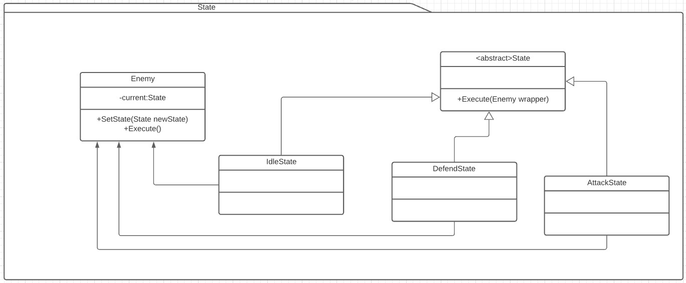

# State
Es un patrón de comportamiento. [Link descripción](https://sourcemaking.com/design_patterns/state)

El patrón nos permite abstraer el funcionamiento de una clase dependiendo de su estado, la clase se comporta como una clase distinta de acuerdo a sus estados.

## Diagrama de clases

## SOLID

* Single responsability

Cada objeto state tiene como objetivo implementar una funcionalidad concreta del grupo de estados posibles. El patrón permite un buen cumplimiento de este principio.

* Open/Closed

Se cumple bastante, aunque al agregar nuevos estados vamos a tener que modificar uno o mas estados existentes para permitir el acceso al estado nuevo.

* Liskov substitution

Los estados estan completamente desacoplados y son perfectamente intercambiables entre sí.

* Interface segregation

Los estados tienen interfaces reducidas y nos permite muy bien segregar interfaces.

* Dependency inversion

Como el principio de sustitución de liskov, el contexto solo espera una interfaz (la del estado abstracto), por lo tanto la inversión de dependencia se cumple.